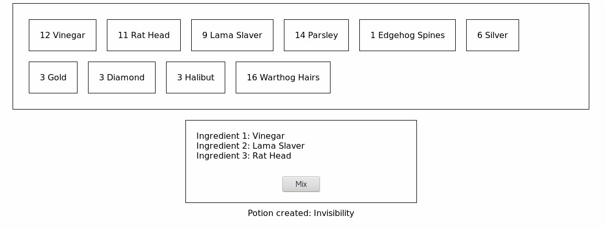

# Node Alchemy Recipe

Web App to do alchemy. Create potion by mixing 3 different ingredients together.
Each ingredient mixed has its quantity decreased by one.



## Create your first potion
Click the first 3 ingredients: 
 - Vinegar
 - Rat Head
 - Lama Slaver
And mix...

Now, it is your turn to find the other ones!

# How to

## Build
```bash
# From alchemy-recipe/client
# Create the front end files the API server will provide
# Build in alchemy-recipe/client/build
# Install the react-app dependencies first
npm run build
```

## Serve

### Client
```bash
# From alchemy-recipe/client
# Proxy is bind to localhost:3000 (see package.json)
# API server has to be launched
npm start
```

### Server
```bash
node alchemy-recipe/server.js
PORT=3005 node alchemy-recipe/server.js
```

## Test
```bash
# From alchemy-recipe/
# Do the route and api tests
jasmine 
```

## API
- GET / -> client
- GET /api/potion/:id -> get potion information
- GET /api/ingredients -> get all the ingredients
- POST /api/mix/:id-ing1-:id-ing2>-:id-ing3 -> mix 3 ingredients and return potion id (-1 if failed)

# Dependencies
All the dependencies are in package.json (project) and alchemy-recipe/client/package.json (specific to react-app)

## Server
  - Node
  - Express
  - Jasmine & supertest
## Client
  - React & react-app
